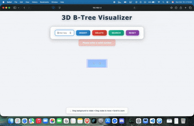

# 3D B-Tree Visualizer

A beautiful 3D visualization of B-Tree data structure using Flask, Three.js, and Python.

### Demo



## Features

- **Insert**: Add keys to the B-Tree with automatic balancing
- **Delete**: Remove keys while maintaining B-Tree properties
- **Search**: Find keys with visual highlighting
- **3D Visualization**: Interactive 3D rendering with camera controls
- **Real-time Updates**: Smooth animations for all operations

## Project Structure

```
btree-visualizer/
│
├── app.py                 # Flask backend with API endpoints
├── btree.py              # B-Tree implementation
├── requirements.txt      # Python dependencies
│
├── templates/
│   └── index.html        # Main HTML template
│
└── static/
    ├── style.css         # CSS styles
    └── visualizer.js     # Three.js visualization and API calls
```

## Installation

### Prerequisites
- Python 3.8 or higher
- pip (Python package manager)

### Setup Steps

1. **Clone or create the project directory**:
```bash
mkdir btree-visualizer
cd btree-visualizer
```

2. **Create the file structure**:
```bash
mkdir templates static
```

3. **Create all the files** with the provided code:
   - `app.py` - Flask backend
   - `btree.py` - B-Tree implementation
   - `requirements.txt` - Dependencies
   - `templates/index.html` - Frontend HTML
   - `static/style.css` - Styles
   - `static/visualizer.js` - 3D visualization

4. **Create a virtual environment** (recommended):
```bash
python -m venv venv
```

5. **Activate the virtual environment**:

   - **Windows**:
   ```bash
   venv\Scripts\activate
   ```
   
   - **macOS/Linux**:
   ```bash
   source venv/bin/activate
   ```

6. **Install dependencies**:
```bash
pip install -r requirements.txt
```

## Running the Application

1. **Start the Flask server**:
```bash
python app.py
```

2. **Open your browser** and navigate to:
```
http://localhost:5000
```

3. **Start visualizing**!
   - Enter a number in the input field
   - Click **Insert** to add it to the tree
   - Click **Delete** to remove it
   - Click **Search** to find and highlight it
   - Click **Reset** to clear the entire tree

## Controls

- **🖱️ Mouse Drag**: Rotate the camera around the tree
- **📜 Mouse Wheel**: Zoom in and out
- **⌨️ Enter Key**: Quick insert (when input is focused)

## B-Tree Properties

- **Minimum Degree (t)**: 3
- **Maximum Keys per Node**: 2t - 1 = 5
- **Minimum Keys per Node**: t - 1 = 2 (except root)
- All leaves are at the same level
- Keys within nodes are sorted

## API Endpoints

### Insert Key
```http
POST /api/insert
Content-Type: application/json

{
  "key": 42,
  "session_id": "default"
}
```

### Delete Key
```http
POST /api/delete
Content-Type: application/json

{
  "key": 42,
  "session_id": "default"
}
```

### Search Key
```http
POST /api/search
Content-Type: application/json

{
  "key": 42,
  "session_id": "default"
}
```

### Reset Tree
```http
POST /api/reset
Content-Type: application/json

{
  "session_id": "default"
}
```

### Get Tree Structure
```http
GET /api/tree?session_id=default
```

## Technology Stack

- **Backend**: Flask (Python)
- **Frontend**: HTML5, CSS3, JavaScript
- **3D Graphics**: Three.js (r128)
- **Data Structure**: Custom B-Tree implementation

## Customization

### Change Minimum Degree

Edit `app.py` and modify the `t` parameter in the `get_btree()` function:

```python
btrees[session_id] = BTree(t=4)  # Change 3 to desired value
```

### Modify Colors

Edit `static/style.css` and `static/visualizer.js` to change the color scheme.

### Adjust Camera Settings

Edit `static/visualizer.js` to modify initial camera position, zoom limits, or rotation speed.

## Troubleshooting

### Port Already in Use
If port 5000 is already in use, modify `app.py`:
```python
app.run(debug=True, host='0.0.0.0', port=5001)  # Change port
```

### Three.js Not Loading
Ensure you have an active internet connection as Three.js is loaded from CDN.

### Keys Not Appearing
Check browser console for errors. Make sure all static files are in the correct directories.

## Future Enhancements

- [ ] Session management with cookies
- [ ] Export tree as image
- [ ] Step-by-step animation mode
- [ ] Multiple tree instances
- [ ] Bulk insert/delete operations
- [ ] Tree statistics display


## Contributing

Contributions are welcome! Please feel free to submit a Pull Request.

---

Made with ❤️ using Flask and Three.js